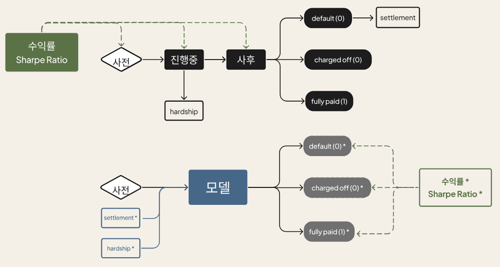

<div align="center">

# LendingClub Credit Default Prediction

**사전 정보 기반 채무불이행 예측 및 수익률 최대화 전략**

**조영서 · 김경은 · 손정민 · 오세욱 · 최민지 · 허웅**

서울대학교 빅데이터 핀테크 전문가 과정 10기

</div>

## Overview

LendingClub(P2P 대출 플랫폼)의 2020년 대출 데이터를 활용하여, **대출 승인 시점의 사전 정보만으로** 채무불이행을 예측하고 투자 수익률을 최대화하는 전략을 제안한다.

기존 LC 전략은 진행중·사후 정보(hardship, settlement)를 활용하지만, 실제 대출 심사 시점에서는 해당 정보를 알 수 없다는 근본적인 한계가 있다. 본 연구는 이 두 사후 변수를 사전 정보로 **별도 예측**하여 채무불이행 모델에 편입시킴으로써, 기존 LC 전략 대비 수익률과 Sharpe Ratio를 대폭 개선하였다.

## Research Framework

<p align="center">
  
</p>

**데이터 구조 (상단)**: LC 데이터셋의 피처는 대출 시점에 따라 사전·진행중·사후로 구분된다. `hardship`은 진행중, `settlement`는 사후 시점에 생성되는 변수이며, 최종 대출 결과(default, charged off, fully paid)도 사후에 확정된다.

**본 연구 접근법 (하단)**: 실제 대출 심사 시점에서는 사전 데이터만 활용 가능하다. 이에 사전 피처만으로 모델을 구성하되, 채무불이행 예측에 중요한 `hardship`·`settlement`를 별도 모델로 사전 예측(hardship\*, settlement\*)하여 피처로 추가함으로써 예측 성능과 수익률을 향상시킨다.

## Key Idea

대출 결과에 결정적인 영향을 미치는 `hardship_flag`와 `debt_settlement_flag`는 대출 승인 이후에 발생하는 사후 정보다. 본 연구는 이를 사전 정보만으로 예측하는 **2단계 피처 엔지니어링** 모델을 구성하였다.

| 단계 | 예측 대상 | 모델 | 최적 임계값 | Accuracy | F1 |
| :--: | :-------- | :--: | :---------: | :------: | :--: |
| 1 | `hardship_flag` | Extra Trees | 0.00 | 99.97% | 0.7647 |
| 2 | `debt_settlement_flag` | Extra Trees | 0.07 | 98.76% | 0.7210 |

예측된 두 변수를 사전 피처로 추가한 뒤, 최종 채무불이행 예측 모델을 학습한다.

## Model

LASSO Logistic Regression으로 선별한 **52개 핵심 피처**를 기반으로 PyCaret을 활용해 다양한 알고리즘을 비교하였으며, **Gradient Boosting Classifier(GBC)** 를 최종 모델로 채택하였다.

| 항목 | 값 |
| :-- | :-- |
| 모델 | Gradient Boosting Classifier |
| 교차 검증 | 10-Fold |
| 최적 임계값 | 0.48 |
| Accuracy (CV) | 90.42% |
| AUC (CV) | 0.9473 |
| F1 (CV) | 0.9404 |
| Kappa / MCC | ~0.697 |

## Results

### 전략 비교

<div align="center">

| 전략 | 가중평균 수익률 | Sharpe Ratio |
| :--: | :-------------: | :----------: |
| 기존 LC (전체 대출 승인) | 1.54% | 0.004 |
| **Our Model (사후정보 예측 포함)** | **8.39%** | **0.451** |

</div>

### 만기별 분석

<div align="center">

| 만기 | 가중평균 IRR | Sharpe Ratio |
| :--: | :----------: | :----------: |
| 36개월 | 3.37% | 0.0813 |
| 60개월 | -1.81% | -0.1008 |

</div>

36개월 대출이 60개월 대비 현저히 우수한 위험 대비 수익률을 보이며, 단기 대출 중심의 포트폴리오 구성이 유리함을 시사한다.

## Project Structure

```
LendingClub/
├── train.py                    # 학습 파이프라인 실행
├── predict.py                  # 테스트 데이터 예측
├── research_framework.png      # 리서치 프레임워크 다이어그램
├── lending_club.txt            # 연구 보고서 전문
├── src/
│   ├── preprocess.py           # 데이터 로딩 및 전처리
│   ├── feature_engineer.py     # 사후정보 예측 모델 (hardship / debt_settlement)
│   ├── model.py                # 채무불이행 예측 모델
│   └── analysis.py             # IRR 및 Sharpe Ratio 분석
├── notebooks/                  # 원본 탐색 노트북 (참고용)
│   ├── LendingClub.ipynb
│   └── lending_club_test.ipynb
├── data/                       # 데이터 파일 (별도 준비, .gitignore)
└── output/                     # 모델 및 예측 결과 (.gitignore)
```

## Getting Started

```bash
pip install -r requirements.txt
```

<div align="center">

| 단계 | 명령어 | 설명 |
| :--: | :----- | :--- |
| 1 | `python train.py` | 전처리 → 피처 엔지니어링 → 모델 학습 → 수익률 분석 |
| 2 | `python predict.py` | 저장된 모델로 테스트 데이터 예측 및 평가 |

</div>

> **데이터**: LendingClub 공식 데이터셋 (1,755,295행 × 141열)
> 실험에는 5% 샘플(`frac=0.05, random_state=42`) 사용
> FRED API를 통해 미국채 수익률(DGS3, DGS5) 실시간 수집
